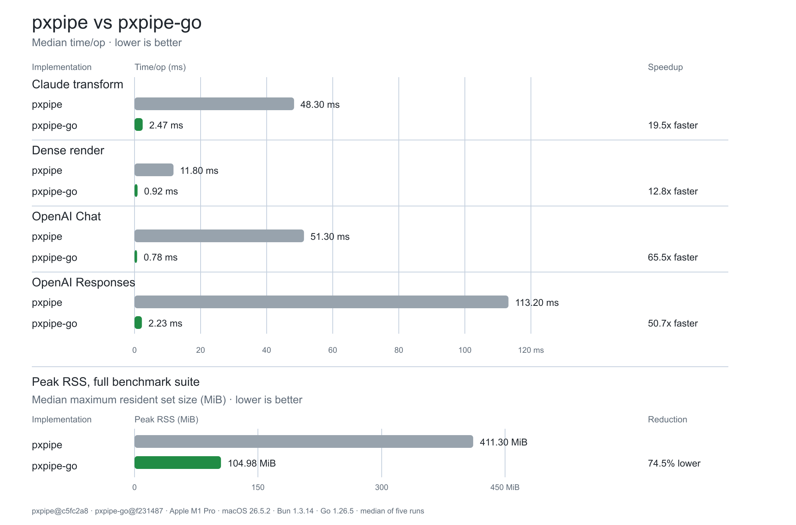

# pxpipe-go

Go port of the core of [pxpipe](https://github.com/teamchong/pxpipe): a
token-saving transform for the Anthropic Messages API that renders bulky
context (system prompt, tool docs, old history, large tool results) into dense
PNG pages, cutting input tokens by reading them through the vision channel.

This port provides a Go **library** and a CLI. Embed the library into your own
Go server as an `http.Handler` reverse proxy or as pure functions over request
bodies. It covers the Anthropic Messages surface **and** the OpenAI Chat
Completions / Responses surfaces (the GPT path, including the o200k-exact
profitability gate and GPT history imaging). The CLI provides process-scoped
MITM launchers for Claude Code, OpenCode, and Codex plus a standalone reverse
and forward proxy with terminal request telemetry. The dashboard, offline
export CLI, and Gemini/Google surface remain out of scope.

## Install

Install the `pxpipe` CLI globally with the pinned release:

```bash
go install github.com/evan-choi/pxpipe-go/cmd/pxpipe@v0.4.0
```

Use `@latest` to install the newest tagged release:

```bash
go install github.com/evan-choi/pxpipe-go/cmd/pxpipe@latest
```

Go installs the binary into `go env GOBIN` when set, or
`$(go env GOPATH)/bin` otherwise. Add that directory to `PATH`; for the default
location:

```bash
export PATH="$(go env GOPATH)/bin:$PATH"
```

## Use the CLI

Run an officially supported CLI directly and pass all following arguments to
the child unchanged:

```bash
pxpipe claude --model opus
pxpipe Claude.app
PXPIPE_MODELS=gpt-5.6-sol pxpipe opencode --model openai/gpt-5.6-sol
PXPIPE_MODELS=gpt-5.6-sol pxpipe codex --model gpt-5.6-sol
```

The Claude profile transforms HTTP requests whose paths end in `/messages` and
preserves `ANTHROPIC_BASE_URL` HTTP(S) overrides. The OpenCode profile covers
paths ending in `/messages`, `/chat/completions`, or `/responses` and disables
OpenCode's experimental WebSocket transport. The Codex profile transforms
paths ending in `/responses`; Codex must use a provider configured with
`supports_websockets=false` because WebSocket request bodies cannot be
transformed. These routes are independent of the provider domain and preserve
the original scheme, authority, path, and query after transformation, so custom
base URLs and localhost intermediaries work without config-file discovery.
Anthropic base URLs normally omit `/v1`; Claude appends `/v1/messages` to the
configured base URL.

On macOS, `Claude.app` is matched case-insensitively and located in
`~/Applications` or `/Applications`. pxpipe starts its bundle executable with a
process-scoped `ANTHROPIC_UNIX_SOCKET`, avoiding CA injection into Claude
Desktop. Fully quit an existing Claude process before launching it so the new
process inherits the socket environment.

Any other executable uses a protocol-neutral profile that transforms paths
ending in `/messages`, `/chat/completions`, or `/responses`:

```bash
pxpipe another-cli --its-child-flag
```

If the executable is literally named `serve` or `help`, disambiguate it with
`pxpipe -- <executable> [args...]`.

The CLI starts process-scoped listeners on kernel-assigned
`127.0.0.1` ports, inherits the child's terminal streams and exit status, and
does not install its CA into the system trust store. Only the child receives
the proxy and CA environment. Requests matching the profile's Messages, Chat
Completions, or Responses routes are transformed; other paths and hosts retain
their original destination. The named profiles can use arbitrary provider
domains, so they decrypt the child's HTTPS connections to inspect the request
path; non-matching requests are forwarded unchanged to their original
destination. When `ANTHROPIC_UNIX_SOCKET` is already set, pxpipe opens a
process-scoped Unix socket for Claude Code, transforms matching HTTP requests,
and forwards them over the original socket. The original socket path is never
exposed to the child.

When the child exits, pxpipe writes a summary to stderr with request and
transformation counts, effective input tokens, saved or lost tokens, output
tokens, and cache hits. Metrics unavailable from the provider are shown as
`-`.

Command startup and process-scoped CA/proxy injection have been smoke-tested
against the installed Claude Code, OpenCode, and Codex releases. Local Codex
path routing, transformation, and upstream restoration are integration-tested;
live OpenCode and Codex inference still need provider end-to-end validation.

### Standalone server

Run a loopback reverse/forward proxy on port `47821`, or select another port
with `-p`/`--port`:

```bash
pxpipe serve
pxpipe serve --port 8080
```

Startup presents ready-to-run Claude and Codex commands. In a terminal, click
the `[copy]` button at the right of either line to copy the full command through
OSC 52. Point clients at the displayed address, for example:

```bash
ANTHROPIC_BASE_URL=http://localhost:47821 claude
NO_PROXY= no_proxy= HTTPS_PROXY=http://localhost:47821 https_proxy=http://localhost:47821 HTTP_PROXY=http://localhost:47821 http_proxy=http://localhost:47821 CODEX_CA_CERTIFICATE='/path/to/pxpipe/mitm-ca.pem' codex
```

The displayed Codex command supplies the generated CA and uses `serve` as a
process-scoped forward proxy. It does not override `model_provider` or its base
URL, so ChatGPT login, OpenAI API keys, custom provider credentials, and
localhost intermediaries retain their original destination and authorization.
Both uppercase and lowercase proxy variables are set by the generated command,
and `NO_PROXY`/`no_proxy` are cleared so localhost providers are intercepted.
The active Codex provider must set `supports_websockets=false` because WebSocket
request bodies cannot be transformed.

The Bubble Tea terminal view shows the 20 most recent requests with status,
endpoint, model, whether context was sent as text or images, cache hits, and
token estimates.
Anthropic `Sent` and cache values use provider-reported usage with cache reads
weighted at `0.1x` and cache creation at `1.25x`. For transformed requests,
`As text` and `Saved/lost` are local estimates based on transform diagnostics;
OpenAI token columns are shown as `-` until OpenAI response usage parsing is
available. Redirected/non-terminal output emits one row per request instead of
redrawing the table. The server shuts down gracefully on interrupt or SIGTERM.

## Use as an embedded reverse proxy

```go
package main

import (
    "log"
    "net/http"
    "net/url"

    pxpipe "github.com/evan-choi/pxpipe-go"
)

func main() {
    anthropic, _ := url.Parse("https://api.anthropic.com")
    openAI, _ := url.Parse("https://api.openai.com")
    h := pxpipe.NewHandler(pxpipe.HandlerOptions{
        AnthropicUpstream: anthropic,
        OpenAIUpstream:    openAI,
        OnResult: func(r *http.Request, res *pxpipe.TransformResult) {
            log.Printf("%s applied=%v reason=%s images=%d",
                r.URL.Path, res.Applied, res.Reason, res.Info.ImageCount)
        },
    })
    log.Fatal(http.ListenAndServe("127.0.0.1:47821", h))
}
```

Then point Claude Code at it:

```bash
ANTHROPIC_BASE_URL=http://127.0.0.1:47821 claude
```

Canonical `/v1/messages` requests go to `AnthropicUpstream`; canonical
`/v1/chat/completions`, `/v1/responses`, and `/v1/responses/*` requests go to
`OpenAIUpstream`. `/v1/models` uses the request's auth style to choose between
them. Both upstreams have the public API defaults shown above.

Provider-prefixed paths (`/anthropic/*`, `/openai/*`,
`/google-ai-studio/*`, `/compat/*`) keep their full path and go to
`AnthropicUpstream`, which lets an API gateway route them. Supported POST
bodies are still transformed by wire shape; `count_tokens`, unknown routes,
and all responses (including SSE) pass through unchanged.

Set `APIKey` or `AuthToken`/`AuthTokenFunc` for Anthropic credentials and
`OpenAIAPIKey` for OpenAI. Direct OpenAI requests never receive `x-api-key` or
`anthropic-*` headers.

The handler defaults to a 5-minute response-header timeout, a 2-minute stream
idle timeout, and a 1-minute identical-request hold. Set
`UpstreamHeadersTimeout`, `UpstreamIdleTimeout`, or `DuplicateHold` to a
duration pointer; a pointer to zero disables that guard. `TransformFunc` can
return live transform options per request and takes precedence over the static
`Transform` value.

A turn containing only `@pxpipe pin` or `@pxpipe unpin` is answered locally in
the caller's Anthropic Messages, Chat Completions, or Responses wire format.
Set `x-pxpipe-bypass: 1` to forward it instead.

### Custom routes

Set `ProtocolOf` to map your own paths to wire protocols; return
`pxpipe.ProtocolNone` to pass a request through, or fall back to
`pxpipe.DefaultProtocolOf` for the built-in rules:

```go
h := pxpipe.NewHandler(pxpipe.HandlerOptions{
    AnthropicUpstream: anthropic,
    OpenAIUpstream:    openAI,
    ProtocolOf: func(path string) pxpipe.Protocol {
        switch path {
        case "/api/llm/claude":
            return pxpipe.ProtocolAnthropicMessages
        case "/api/llm/gpt/chat":
            return pxpipe.ProtocolOpenAIChat
        case "/api/llm/gpt/responses":
            return pxpipe.ProtocolOpenAIResponses
        }
        return pxpipe.DefaultProtocolOf(path)
    },
    RewritePath: func(path string, _ pxpipe.Protocol) string {
        switch path {
        case "/api/llm/claude":
            return "/v1/messages"
        case "/api/llm/gpt/chat":
            return "/v1/chat/completions"
        case "/api/llm/gpt/responses":
            return "/v1/responses"
        }
        return path
    },
})
```

`ProtocolOf` chooses the request-body transform. `RewritePath` chooses the
outbound API path, which also controls direct Anthropic/OpenAI routing.
`UpstreamFor` can select an HTTP(S) upstream per request and protocol; a
non-nil result takes precedence over `AnthropicUpstream` and `OpenAIUpstream`.
`OnResponseComplete` runs after a response body reaches a clean EOF and includes
Anthropic JSON/SSE token usage when present.

## Use as a pure transform

```go
res := pxpipe.TransformAnthropicMessages(pxpipe.TransformInput{
    Body:  bodyBytes,          // the JSON request body
    Model: "claude-fable-5",  // resolved model id (gates applicability)
})
if res.Applied {
    forward(res.Body)
} else {
    forward(bodyBytes) // res.Reason explains why (below_min_chars, …)
}
```

For the OpenAI surfaces:

```go
body, info := pxpipe.TransformOpenAIChatCompletions(bodyBytes, nil)
body, info  = pxpipe.TransformOpenAIResponses(bodyBytes, nil)
```

Per-model GPT render/pricing profiles (gpt-5.x, o-series, Grok, …) resolve via
`pxpipe.ResolveGptProfile`; unknown models can be declared without a code
change through the `PXPIPE_GPT_PROFILES` env JSON, exactly as upstream.

Or render arbitrary text with the same model-specific geometry and style:

```go
out, _ := pxpipe.RenderTextToImages(text, pxpipe.RenderOptions{
    Model: "gpt-5.6-sol",
    Reflow: true,
})
for _, page := range out.Pages { os.WriteFile("page.png", page.PNG, 0o644) }
```

## Model scope

Same semantics as upstream pxpipe: the built-in allowlist is
`claude-fable-5` plus `gemini-3.6-flash`; GPT models are opt-in. Override with
the `PXPIPE_MODELS` env CSV (e.g. `PXPIPE_MODELS=claude-fable-5,gpt-5.6-sol`)
or at runtime via `pxpipe.SetAllowedModelBases`. Unlisted models pass through
untransformed — that is the escape hatch for byte-exact work.

## Fidelity

The port is verified against golden fixtures generated by the TypeScript
reference implementation (`testdata/`, tooling in `tools/`):

- 17 render cases pass **pixel-exact** (PNG bytes differ only by deflate
  implementation; decoded pixels are identical).
- 9 Anthropic transform cases match on every text output, hash, gate
  verdict, page count, and page dimensions; image blocks are compared by
  decoded pixels.
- 15 OpenAI (Chat + Responses) cases match on every text output, hash, gate
  verdict (including exact o200k token counts), history-collapse plan, page
  count, and page dimensions; the embedded o200k tokenizer reproduces
  gpt-tokenizer counts exactly.
- GPT model-profile resolution (27 ids incl. env overrides and misresolution
  guards) matches the TS table verbatim.
- TS UTF-16 string-length semantics are reproduced for every char gate and
  telemetry counter; JSON object key order is preserved through parse →
  imaged-text serialization so rendered tool schemas match the reference
  byte-for-byte.

Known deviations:

- PNG byte streams (and therefore `imageBytes`, `historyImageSha`,
  `cachePrefixSha8`) differ from TS — deflate output is implementation
  specific. They remain deterministic per input, which is what prompt-cache
  stability requires.
- Keys *added* by the transform to objects it did not create serialize after
  the object's original keys in sorted order (TS appends in insertion order).
- No Gemini/Google surface, Messages↔OpenAI bridges, or savings
  measurement.

## Performance



Measured natively on an Apple M1 Pro running macOS 26.5.2, with Node 26.5.0
and Go 1.26.5. Go used the machine-default `GOMAXPROCS=10` and no PGO profile.
The comparison uses `pxpipe@a9b9759` and the current pxpipe-go worktree based
on `27ef82c` (2026-08-07).

Values are medians of five runs. Each pxpipe run performs two warmups and
three timed iterations; its table value is the median per-run mean. Each
pxpipe-go run uses a one-second benchmark window. Actual latency varies with
CPU architecture, available cores, and request content.

| benchmark | pxpipe time/op | pxpipe-go time/op | speedup |
|---|---:|---:|---:|
| TransformBigClaudeCode | 162.60 ms | 16.12 ms | 10.1× |
| RenderDensePage | 390.40 ms | 8.66 ms | 45.1× |
| TransformOpenAIChat | 120.10 ms | 7.08 ms | 17.0× |
| TransformOpenAIResponses | 650.40 ms | 15.79 ms | 41.2× |

Peak RSS was measured over the full four-benchmark suite in a fresh process
for each run:

| implementation | median peak RSS | relative to pxpipe |
|---|---:|---:|
| pxpipe | 322.19 MiB | baseline |
| pxpipe-go | 111.89 MiB | 65.3% lower |

Go's `-benchmem` output reports the following allocation volume per operation:

| benchmark | B/op | allocs/op |
|---|---:|---:|
| TransformBigClaudeCode | 2,400,496 | 3,679 |
| RenderDensePage | 801,775 | 70 |
| TransformOpenAIChat | 1,078,492 | 1,763 |
| TransformOpenAIResponses | 1,991,537 | 2,073 |

Raw GC counts are not compared because V8 and Go use different collectors and
event semantics. Peak RSS is the cross-runtime memory metric; `B/op` and
`allocs/op` identify allocation pressure within the Go implementation.

After installing dependencies, reproduce the latency and allocation comparison
from the repository root on Apple Silicon macOS:

```bash
for benchmark_run in 1 2 3 4 5; do
  (cd pxpipe && pnpm exec tsx ../tools/bench-ts.ts)
done

GOTOOLCHAIN=go1.26.5 go test -pgo=off -run '^$' \
  -bench '^(BenchmarkTransformBigClaudeCode|BenchmarkRenderDensePage|BenchmarkTransformOpenAIChat|BenchmarkTransformOpenAIResponses)$' \
  -benchtime=1s -benchmem -count=5 .
```

Reproduce peak RSS with macOS `/usr/bin/time -l` by running each full suite in
a fresh process five times and taking the median `maximum resident set size`
value (reported in bytes). Build the Go benchmark binary first so the
measurement excludes the compiler and `go` command:

```bash
for benchmark_run in 1 2 3 4 5; do
  (cd pxpipe &&
    /usr/bin/time -l pnpm exec tsx ../tools/bench-ts.ts >/dev/null)
done

GOTOOLCHAIN=go1.26.5 go test -pgo=off \
  -c -o /tmp/pxpipe-go-bench.test .
for benchmark_run in 1 2 3 4 5; do
  /usr/bin/time -l /tmp/pxpipe-go-bench.test -test.run '^$' \
    -test.bench '^(BenchmarkTransformBigClaudeCode|BenchmarkRenderDensePage|BenchmarkTransformOpenAIChat|BenchmarkTransformOpenAIResponses)$' \
    -test.benchtime=1s -test.count=1 >/dev/null
done
```

Linux ARM64 profiles show PNG rendering and zlib as the largest remaining CPU
cost. The renderer uses zlib level 6; framebuffers and encoders are pooled.

For production validation, run the native Linux harness inside an Alpine pod
on the same EKS instance family and architecture as production. It rejects
macOS, non-Alpine environments, architecture mismatches, Docker Desktop,
LinuxKit, and WSL. Set `BENCH_GOMAXPROCS` to the pod's integer CPU limit:

```bash
BENCH_GOMAXPROCS=4 tools/bench-linux.sh /results/current
BENCH_GOMAXPROCS=4 BENCH_PGO=1 tools/bench-linux.sh /results/current-pgo
```

Run the first command from clean baseline and candidate checkouts, then compare
their `sequential.txt` and `parallel.txt` files with `benchstat`. PGO profiles
are workload- and architecture-specific; do not ship a profile trained on a
developer machine or an emulated CPU.

## Regenerating fixtures

Initialize the pinned TS reference implementation first:

```bash
git submodule update --init --recursive
cd pxpipe
pnpm install --frozen-lockfile
pnpm exec tsx ../tools/dump-atlas.ts
pnpm exec tsx ../tools/gen-fixtures.ts
pnpm exec tsx ../tools/gen-fixtures-openai.ts
pnpm exec tsx ../tools/dump-gpt-profiles.ts > ../testdata/openai/profiles.json
```

See [UPSTREAM.md](UPSTREAM.md) for the pinned reference revision and current
porting status.

## License

MIT. Portions derived from [teamchong/pxpipe](https://github.com/teamchong/pxpipe) (MIT).
